# XpertiseX

XpertiseX is an advanced ed-tech platform designed to revolutionize the way users create, consume, and rate educational content. Built on the robust MERN stack, including ReactJS, NodeJS, MongoDB, and ExpressJS, XpertiseX offers a seamless and interactive learning experience for students while providing a platform for instructors to showcase their expertise worldwide.

## System Architecture

XpertiseX follows a client-server architecture with three main components: the front end, the back end, and the database. The front end, built using ReactJS, communicates with the NodeJS and ExpressJS back end through RESTful API calls. MongoDB serves as the flexible and scalable database solution for storing course content, user data, and platform-related information.

### Front-end

The user-facing part of XpertiseX is designed using ReactJS, ensuring dynamic, responsive, and engaging user interfaces. The front end includes essential pages such as the homepage, course list, wishlist, checkout, course content, user details, and account management pages for both students and instructors.

### Back-end

The back end of XpertiseX is powered by NodeJS and ExpressJS, providing APIs for user authentication, course management, payment integration, media handling, and more. MongoDB is utilized for data storage, including user details, course information, and media content. Security features like JWT for authentication and Bcrypt for password hashing ensure data protection.

### Database

XpertiseX utilizes MongoDB as its primary NoSQL database, offering flexibility in storing unstructured and semi-structured data. Data models include schemas for students, instructors, courses, and media content, facilitating efficient data management and retrieval.

## API Design

The API design of XpertiseX follows RESTful principles, implemented using NodeJS and ExpressJS. Sample API endpoints include user authentication, course management, course ratings, and media handling, enabling seamless communication between the front end and back end.

## Deployment

Deployment of XpertiseX involves hosting the front end on Vercel for fast and scalable static site hosting. The back end is hosted on Render or Railway, cloud-based platforms for Node.js applications, ensuring reliability and scalability. Media files are managed on Cloudinary, while MongoDB Atlas provides a secure and managed database environment.

## Live Link 
https://xpertisex.vercel.app/

## See the following screenshots of this project

- **Landing Page**

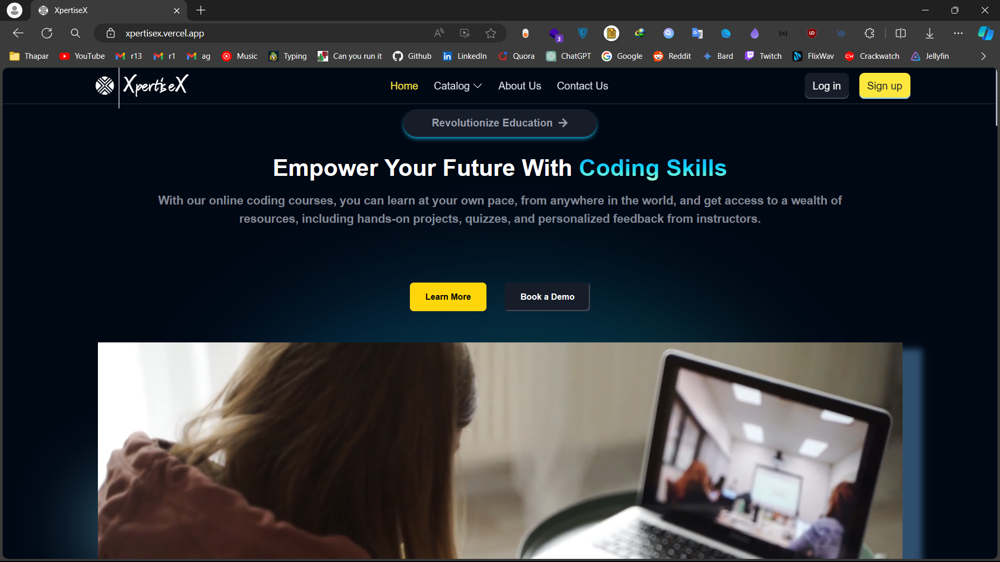

- **Landing Page**

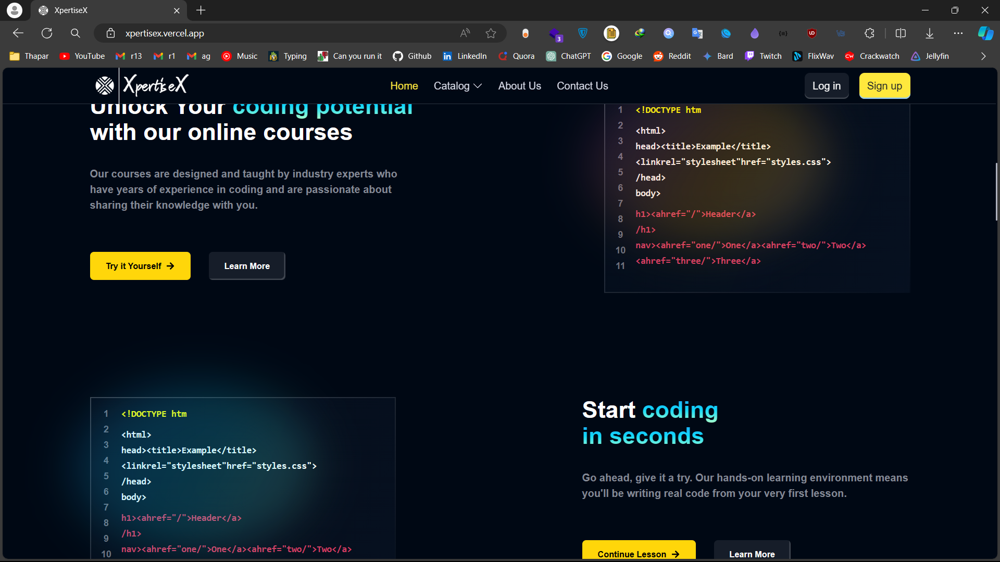

- **Review component**

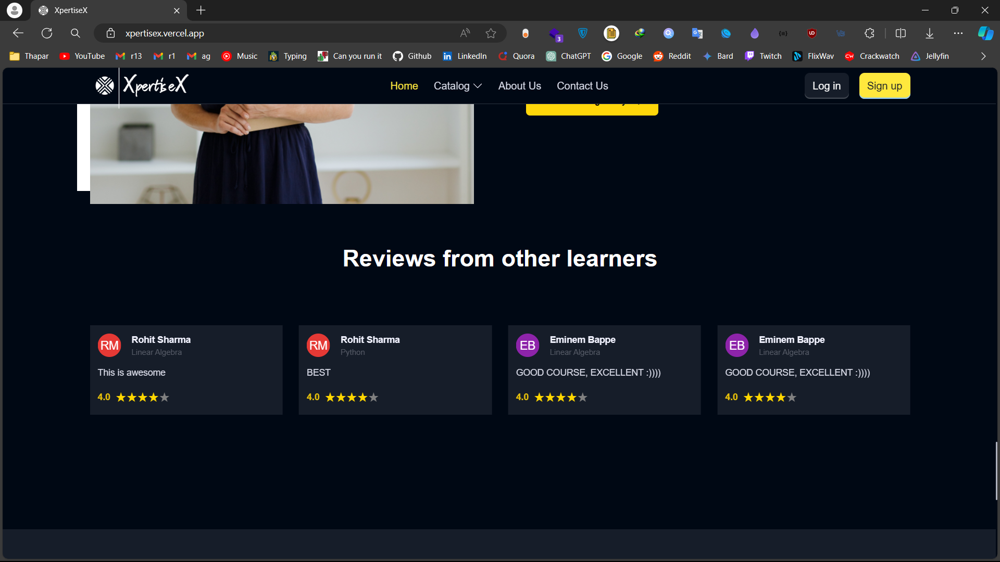
- **Student Dashboard**

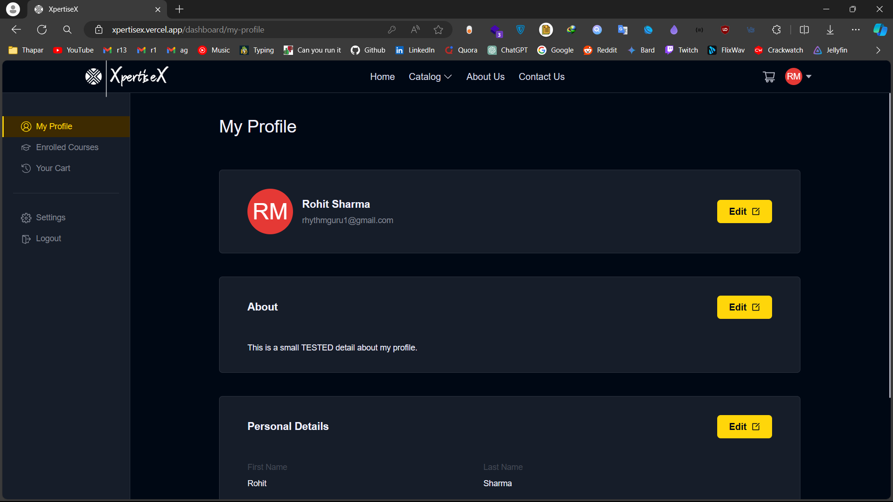

- **Student enrolled courses**

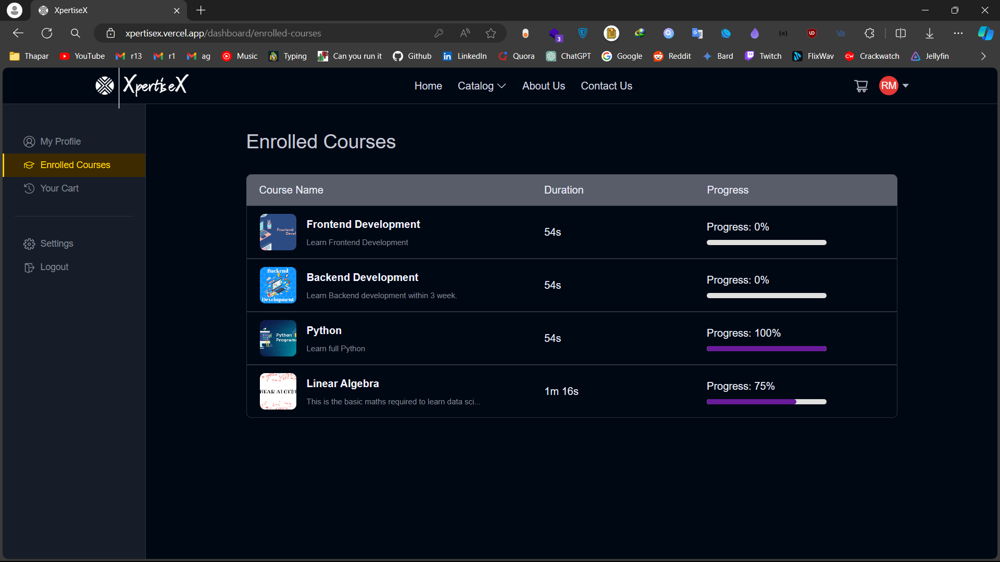

- **Learning from course**

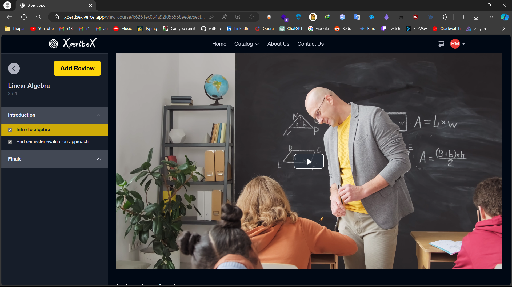

- **Frequent courses**

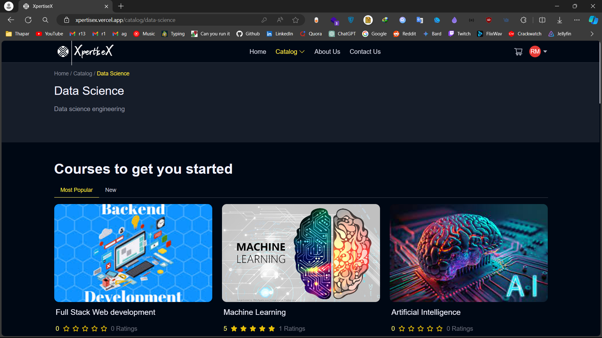

- **Course overview**

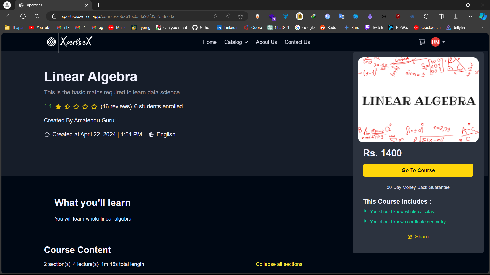
- **Instructor course dashboard**
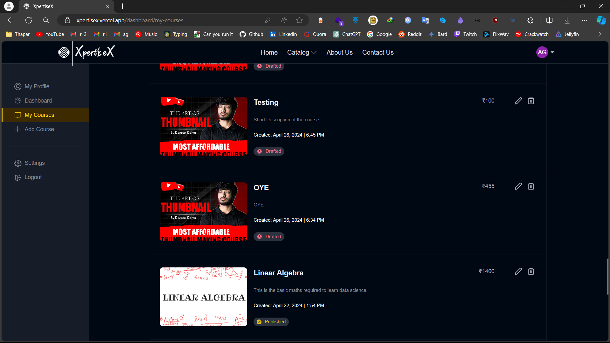
- **Student course dashboard**

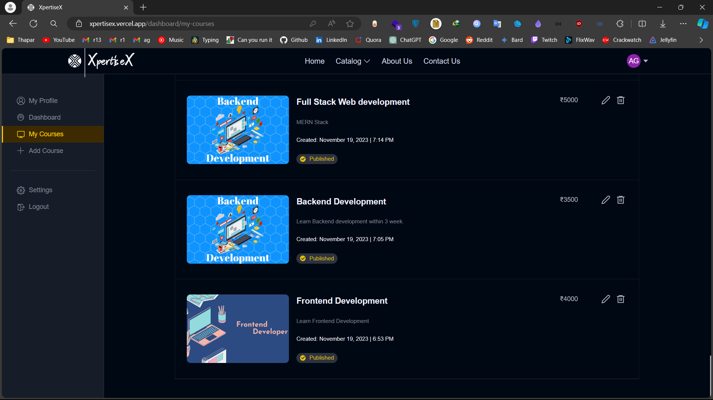
- **Instructor course overview dashboard**

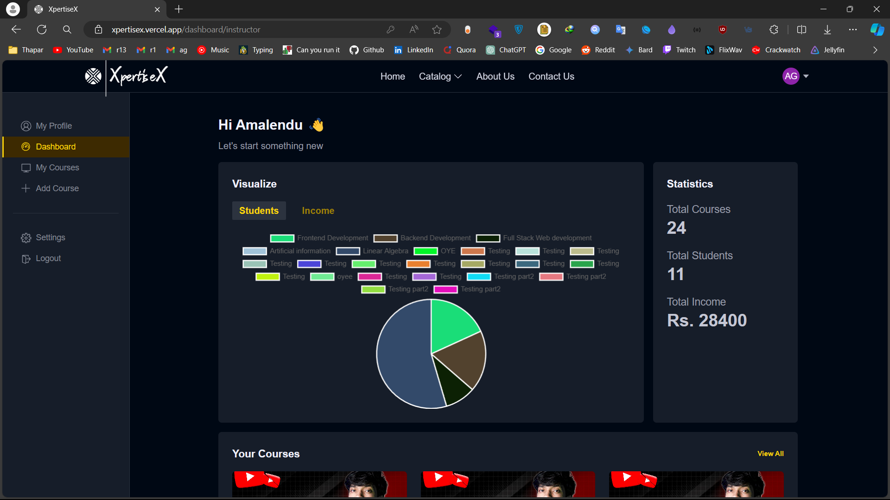
- **Course creation**

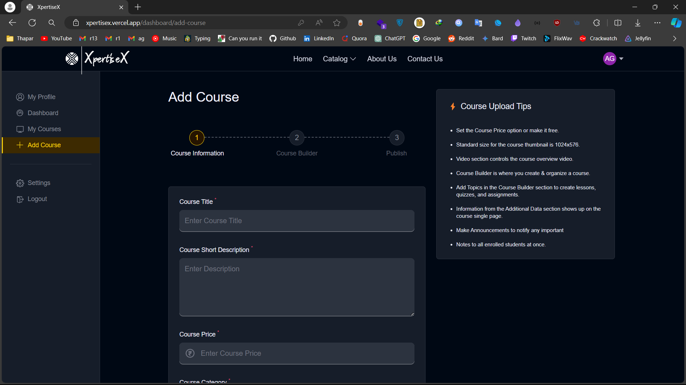
- **Course content view while browsing**

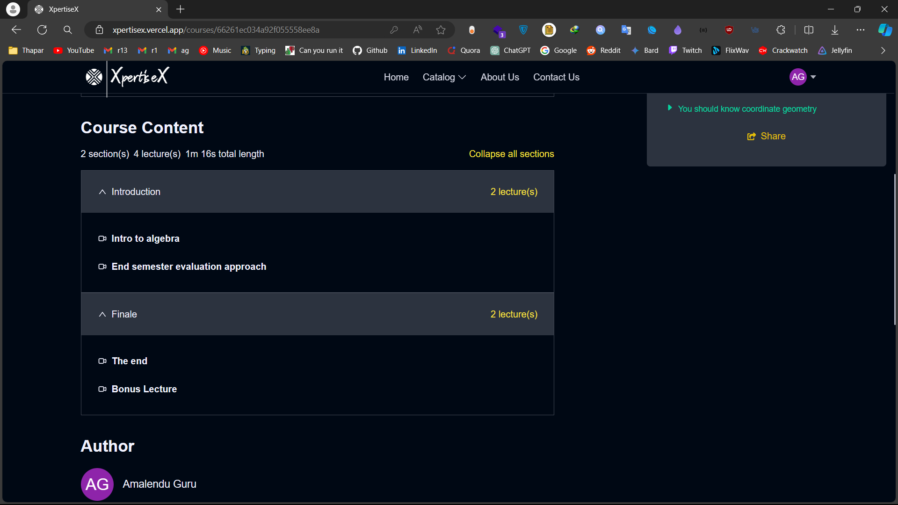
